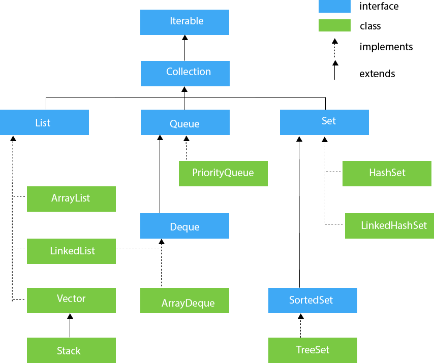
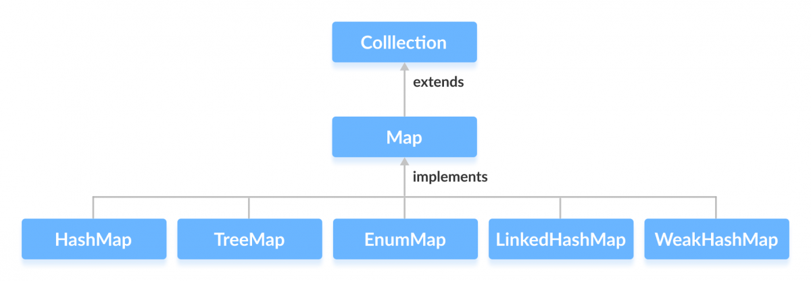
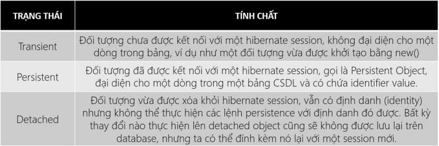

<!-- @format -->

# Summary


## OOP

- Destructor: Dùng **garbage collector**
- **static**:
  - Dùng chung cho tất cả đối tượng
  - **static** method không thể truy cập trực tiếp các attribute/method của đối tượng

```java
        public class Number {
            int num;
            public static int inc(){
                Number number = new Number();
                return number.num++;
            }
        }
```

- Gọi kèm với tên class `Number.inc()` ;

### 4 tính chất hướng đối tượng

- Encapsulation
- Inheritance
- Abstract
- Polymorphism

## Read and write file

```java
// File input
FileInputStream in = new FileInputStream("in.txt");
BufferedReader br = new BufferedReader(new InputStreamReader(in, "UTF-8"));
String str = br.readLine

// File output
FileOutputStream out = new FileOutputStream("out.txt");
BufferedWriter bw = new BufferedWriter(new OutputStreamReader(out, "UTF-8"));
bw.write(str);// FileOutputStream
```

## Handling exception

```java
ArrayIndexOutOfBoundsException exc
exc.printStackTrace();
```

> `finaly{}` sẽ được thực thi sau khi rời khỏi try/catch

## Generics

### 1. Generic Class

```java
// A Simple Java program to show multiple
// type parameters in Java Generics

// We use < > to specify Parameter type
class Test<T, U>
{
    T obj1;  // An object of type T
    U obj2;  // An object of type U

    // constructor
    Test(T obj1, U obj2)
    {
        this.obj1 = obj1;
        this.obj2 = obj2;
    }

    // To print objects of T and U
    public void print()
    {
        System.out.println(obj1);
        System.out.println(obj2);
    }
}

// Driver class to test above
class Main
{
    public static void main (String[] args)
    {
        Test <String, Integer> obj =
            new Test<String, Integer>("GfG", 15);

        obj.print();
    }
}
```

### 2. Generic Function

```java
// A Simple Java program to show working of user defined
// Generic functions

class Test
{
    private int len = 0;
    // A Generic method example
    static <T> void genericDisplay (T element)
    {
        System.out.println(element.getClass().getName() +
                           " = " + element);
    }

    <T extend Number> increaseLength(T arg){

        len+ = arg.intValue;
    }

    public int getLength(){
        return this.len;
    }

    // Driver method
    public static void main(String[] args)
    {
         // Calling generic method with Integer argument
        genericDisplay(11);

        // Calling generic method with String argument
        genericDisplay("GeeksForGeeks");

        // Calling generic method with double argument
        genericDisplay(1.0);

        Text text = new Text();
        text.increaseLength(5);
    }
}
```

### 3. And more 💔

#### Wildcard

- \<? **extends** type>
  
  Chấp nhận mọi đối tượng với điều kiện đối tượng đó **kế thừa** từ type hoặc là đối tượng của type
  
  > Ví dụ: **List<? extends Number>**

- \<? **super** type>
  
  Chấp nhận mọi đối tượng với điều kiện đối tượng đó là **lớp cha** của type hoặc là đối tượng của type

## Java Collection Framework 😎

|  |
|:-------------------------------:|
| _Collection Framework Diagram_  |

### 1. Set Interface

- Là một collection không tuần tự.
- Không thể lấy phần tử thông qua index
- Chỉ lưu trữ duy nhất một giá trị trong collection (không chứa giá trị trùng lặp).
- Set được sử dụng để biểu diễn các bộ như bộ tú lơ khơ, TKB của học sinh….

Các lớp kế thừa_

#### 1.1 TreeSet

- Các phần tử trong Set được sắp xếp theo thứ tự.
- Khi truyền vào TreeSet một class thì class đó phải kế thừa từ interface **Comparable** và _overide_ hàm **compareTo()**

#### 1.2 HashSet

- Các phần tử được lưu trữ dưới dạng bảng băm.

#### 1.3 LinkedHashSet

- Giống như HashSet nhưng các phần tử trong LinkedHashSet được duy trì thứ tự như lúc chúng được thêm vào.

### 2. List Interface

- Có cấu trúc dữ liệu tuyến tính.
- Các phần tử được duy trì theo thứ tự thêm vào và có thể truy cập chúng bằng chỉ số vị trí.
- List có thể chứa các phần tử trùng lặp còn Set thì không.

Các lớp kế thừa_

#### 2.1 ArrayList

- Kích thước mảng có thể thay đổi
- Tăng 50% size khi số phần từ > khả năng chứa

#### 2.2 LinkedList

- Danh sách liên kết đôi

#### 2.3 Vector

- Giống ArrayList
- Dùng cho môi trường đa luồng do tính năng tự đồng bộ hóa
- Tăng 100% size khi số phần từ > khả năng chứa

#### 2.4 Stack

- Dữ liệu ngăn xếp
- Last in first out (LIFO) 😫

### 3. Queue Interface

- Có cấu trúc dữ liệu tuần tự.
- Hoạt động theo cách thức FIFO (First In First Out) cho nên bạn chỉ có thể chạm vào phần tử đứng ở đầu hàng đợi.
- Tất cả các phần tử được chèn vào phía cuối của hàng đợi và xóa phần tử đầu tiên của hàng đợi

Các lớp kế thừa_

#### 3.1 LinkedList

- Danh sách liên kết đôi

#### 3.2 PriorityQueue

- Là dạng queque dựa vào độ ưu tiên từ hàm **Comparator**

#### 3.3 ArrayDeque

- Là dạng queque 2 chiều

### 4. Map Interface

|  |
|:-------------------------------:|
| _Map Diagram_                   |

- Không kế thừa từ Collection Interface.

- Lưu trữ cặp dữ liệu key-value, ánh xạ mỗi key tương ứng với một giá trị.

- Map không thể chứa key trùng lặp nhưng có thể có value trùng lặp.

- Mỗi key ánh xạ nhiều nhất đến 1 giá trị.
  
  onetoone

#### 4.1 TreeMap

- Thực thi giao diện Map Interface với dạng cây đỏ đen ( Red - Black tree ) trong đó các key đã được sắp xếp.

#### 4.2 HashMap

- Thực thi giao diện Map Interface với các key được lưu trữ dưới dạng bảng băm

#### 4.3 LinkedHashMap

- Tương tự như HashMap nhưng duy trì thứ tự chèn.

#### 4.4 WeakHashMap

- Tương tự như HashMap tuy nhiên có 1 điểm khác biệt đáng chú ý là các key trong Map chỉ là các Weak reference .

## Collections Class

## Java Swing

- Swing sử dụng kiến trúc MVC
  - Model: thể hiện dữ liệu
  - View: thể hiện giao diện
  - Controller: nhận input từ người dùng và xử lí

### JFrame

- Là giao diện chính

```java
public class ViDu1Frame extends JFrame{
    public ViDu1Frame() {
        super();
        this.initComponents();
    }
    private void initComponents() {
        this.setDefaultCloseOperation(WindowConstants.EXIT_ON_CLOSE);
        ImageIcon icon=new ImageIcon(
            this.getClass().getResource("images/java-icon.jpg")
        );
        this.setIconImage(icon.getImage());
        this.setTitle("Ví dụ 1");
        this.setLocation(0, 0);
        this.setSize(300, 400);
        this.setExtendedState(JFrame.NORMAL);
    }
}
```

- Lựa chọn
  - JFrame. NORMAL
  - JFrame. ICONIFIED
  - JFrame. MAXIMIZED_HORIZ
  - JFrame. MAXIMIZED_VERT
  - JFrame. MAXIMIZED_BOTH
- Môt số phương thức: setImage, setIcon, setSize, setVisible, public Containter getContentPane()

### JDialog

- Dùng dialog để nhập hoặc liệu
- Có 2 trạng thái :
  - Modal : Thực hiên xong dialog -> form cha (recommend)
  - Modeless : Có thể thực hiện trên form cha
- Phương thức gần giống JFrame

### JDesktopPane & JInternalFrame

- Sử dung xây dựng ứng dụng MDI

### JPanel

- Gom nhóm control
  
  > JFrame <- JDesktopPane <- JInternalFrame <- JPannel <-> JPannel

### Container

- Mỗi **Container** có một đối tượng **Layout Manager**

- **Layout Manager** là một đối tượng quyết định cách sắp
  
  xếp vị trí của các **Component** bên trong một **Container**.

- **Layout Manager** :
  
  - Flow Layout
  - Border Layout
  - Card Layout
  - Grid Layout
  - Grid Bag Layout
  - Box Layout
  - Group Layout

## Java Message Services

- Là 1 API cung cấp cơ sở để tạo, gửi và nhận tin nhắn giữa 2 hay nhiều client thông qua Message Oriented middleware (MOM).

- Bao gồm 2 thành phần: - API : hỗi trợ chức năng cho người phát triển. - SPI(Service Provider Interface) : Cho phép các +Provider tạo ra cá tool JMS tích hơp, định hướng cho mọi người sử dụng theo hướng chuẩn hóa.
  
  +Java Boker: để gửi và nhận tin nhắn trước tiên, JMS client phải kết nối với JMSmessage Server (JMS Boder).

- Có 2 mô hình JMS:
  
  - Point to point + Có 3 thành phần sender, Queue, recever. + Người nhận sẽ luông đc tin nhắn dù có đang active hay không.
  - Publisher/Subcriber: + Có 3 thành phần Sender, topic, receiver + Có thời gian dependency nên những sub/sub có thể không nhận được các tin nhắn khi không active cả trước và sau khi đăng ký.

- JMS Adminsistered Object + Destination(Queue, Topic)
  
  - Connection Factory: Tạo Connection giữa JMSProvide và JMS Client.

## Hibernate



- Các từ khóa annotation: `@Entity, @Table(name="", schema=""), @Column(name="", ..), @Id,`
- Các mối kếp hợp : `@OneToOne, @OneToMany, @ManyToOne, @ManyToMany`

```java
// JoinConference.class
    @OneToMany(mappedBy = "conferenceByIdConfId",fetch = FetchType.EAGER)
    private Set<JoinTheConference> joinTheConference;
// Conference.class
    @ManyToOne(targetEntity = Conference.class)
    @JoinColumn(name = "CONFID", referencedColumnName = "CONFID", nullable = true)
    private Conference conferenceByIdConfId;
```

Truy vấn đơn giản

```java
    String hql="from Models.Account as i where i.username=:username";
    Query query=session.createQuery(hql);
    query.setParameter("username", username);
    List<Account> list =query.list();
```

```java
<!DOCTYPE hibernate-configuration PUBLIC
        "-//Hibernate/Hibernate Configuration DTD//EN"
        "http://www.hibernate.org/dtd/hibernate-configuration-3.0.dtd">
<hibernate-configuration>
    <session-factory>
        <property name="connection.url">jdbc:mysql://localhost:3306/qlhoinghi</property>
        <property name="connection.driver_class">com.mysql.cj.jdbc.Driver</property>
        <property name="connection.username">root</property>
        <property name="connection.password">8888</property>

        <mapping class="Models.Place"/>
        <mapping class="Models.Conference"/>
        <mapping class="Models.Account"/>
        <mapping class="Models.JoinTheConference"/>

        <!-- DB schema will be updated if needed -->
        <!-- <property name="hibernate.hbm2ddl.auto">update</property> -->
    </session-factory>
</hibernate-configuration>
```

```java
public class HibernateAnnotationUtil {
    private static SessionFactory sessionFactory;

    public static SessionFactory buildSessionFactory(){
        try {
            Configuration configuration = new Configuration();
            configuration.configure("hibernate.cfg.xml");

            sessionFactory = configuration.buildSessionFactory();
            return sessionFactory;
        }catch (Throwable ex){
            System.err.println("Intial SesstionFactory creation failed + " + ex);
            throw new ExceptionInInitializerError(ex);
        }
    }

    public static SessionFactory getSessionFactory() {
        if(sessionFactory == null)
            sessionFactory = buildSessionFactory();
        return sessionFactory;
    }

}
```

## Thread

### Concurrency và Parallelism

- Concurrency chạy nhiều tác vụ trên 1 core CPU được hệ điều hành phân chia thời gian chạy (khác thời điểm)
- Parallelism chạy nhiều tác vụ trên nhiều core tại cùng thời điểm

### Đa luồng có thể tạo bằng 2 cách

1. Extend class Thread
2. Implement giao diện Runnable

```java
// Java code for thread creation by implementing
// the Runnable Interface
class MultithreadingDemo implements Runnable
{
    public void run()
    {
        try
        {
            // Displaying the thread that is running
            System.out.println ("Thread " +
                                Thread.currentThread().getId() +
                                " is running");

        }
        catch (Exception e)
        {
            // Throwing an exception
            System.out.println ("Exception is caught");
        }
    }
}

// Main Class
class Multithread
{
    public static void main(String[] args)
    {
        int n = 8; // Number of threads
        for (int i=0; i<n; i++)
        {
            Thread object = new Thread(new MultithreadingDemo());
            object.start();
        }
    }
}
```

## Java Synchronized Blocks

1. Phương thức thông thường

2. Phương thức tĩnh (static method)
- Có _static_ nên phương thức bị lock => chỉ có 1 thread chạy trên class

```java
public static synchronized void add(int value){
      this.count += value;
}
```

1. Khối code (Synchronized blocks) được đồng bộ bên trong phương thức
2. Khối code được đồng bộ bên trong phương thức tĩnh

```java
public class MyClass {

    public static synchronized void log1(String msg1, String msg2){
       log.writeln(msg1);
       log.writeln(msg2);
    }

    public static void log2(String msg1, String msg2){
       synchronized(MyClass.class){
          log.writeln(msg1);
          log.writeln(msg2);
       }
    }
 }
```

## Networkingonetoone

| TCP                                                   | UDP                                                        |
| ----------------------------------------------------- | ---------------------------------------------------------- |
| Truyền dữ liệu đang tín cậy                           | Truyền dữ liệu không đáng tin cậy                          |
| Đảm bảo tính toàn vẹn dữ liệu đến                     | Không đảm bảo dữ liệu đến                                  |
| Kiểm tra lỗi luồng gửi gói tin                        | Không kiểm tra                                             |
| Heading lớn chứa dữ liệu tùy chọn                     | Heading nhỏ chứa dữ liệu bắt buôc                          |
| Chậm                                                  | Nhanh                                                      |
| Cho ứng dụng dụng đáng tin cậy như mail, tin nhắn, .. | Cho ứng dụng cần tốc độ nhanh như gameonline, xem phim, .. |

### Connecting to a URL

```java
URL url = new URL("httpl://vnexpress.net/");
URLConnection myURLConnection = url.openConnection();
myURLConnection.openConnect();
```
